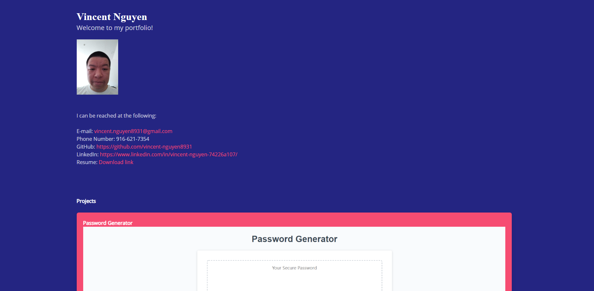

# Vincent-nguyen8931-portfolio

Description
------------

Personal portfolio with links to my other projects and LinkedIn.

 Table of contents
---------------
[Tools used](#Tools-used) 
[Deployed here](#Deployed-here) 
[Credits](#Credits) 
[License](#License)

Tools used
-------------------

* Bulma - Has premade layouts and components useful for making a webpage without having to start from scratch. 
* CSS - Style the page with custom colors, and spacing.
* GitBash - Assist with version control via commits, push, and pull to and from GitHub.
* GitHub - Site where the repository lies for deployment and edits.
* Google fonts - Font that can be seen on any OS.
* HTML - Contains the base of the webpage and allows browsers to interpret the code as a webpage.
* Node.js - Calls in modules necessary for bulma CSS styling.
* VS Code - Application used to write and edit code for the webpage.

Deployed here
-------------

Below is the link to the deployed webpage.  
[Link to site](https://vincent-nguyen8931.github.io/Vincent-nguyen8931-portfolio/)

Credits
---------------
LinkedIn: [https://www.linkedin.com/in/vincent-nguyen-74226a107/](https://www.linkedin.com/in/vincent-nguyen-74226a107/)  
GitHub: [https://github.com/vincent-nguyen8931](https://github.com/vincent-nguyen8931)

License
----------
MIT License

Copyright (c) [2021] [Vincent Nguyen]

Permission is hereby granted, free of charge, to any person obtaining a copy
of this software and associated documentation files (the "Software"), to deal
in the Software without restriction, including without limitation the rights
to use, copy, modify, merge, publish, distribute, sublicense, and/or sell
copies of the Software, and to permit persons to whom the Software is
furnished to do so, subject to the following conditions:

The above copyright notice and this permission notice shall be included in all
copies or substantial portions of the Software.

THE SOFTWARE IS PROVIDED "AS IS", WITHOUT WARRANTY OF ANY KIND, EXPRESS OR
IMPLIED, INCLUDING BUT NOT LIMITED TO THE WARRANTIES OF MERCHANTABILITY,
FITNESS FOR A PARTICULAR PURPOSE AND NONINFRINGEMENT. IN NO EVENT SHALL THE
AUTHORS OR COPYRIGHT HOLDERS BE LIABLE FOR ANY CLAIM, DAMAGES OR OTHER
LIABILITY, WHETHER IN AN ACTION OF CONTRACT, TORT OR OTHERWISE, ARISING FROM,
OUT OF OR IN CONNECTION WITH THE SOFTWARE OR THE USE OR OTHER DEALINGS IN THE
SOFTWARE.